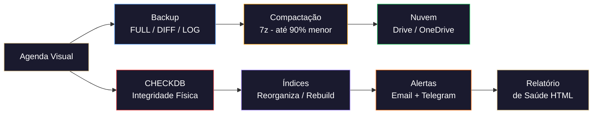

  
  
  
  

<h1 align="center">🛡️ FortiSQL Ops</h1>

  <strong>Agente inteligente de manutenção para Microsoft SQL Server.</strong> 
  Backups automatizados · Integridade (CHECKDB) · Compactação 7z · Nuvem · Alertas

---

## Como Funciona

O FortiSQL roda como um agente na bandeja do sistema (system tray), executando ciclos de manutenção de forma autônoma. Não depende do SQL Server Agent, perfeito para **SQL Server Express**.

## Instalação

1. Clique no botão acima para baixar o instalador (sempre a versão mais recente).
2. Execute no servidor Windows e siga o assistente.
3. Configure a conexão SQL Server (Windows Auth ou SQL Auth).
4. Defina os diretórios de backup e horários desejados.
5. Salve e aplique. O agente começa a rodar automaticamente na bandeja do sistema.

> 💡 **Dica**: Aponte o diretório de nuvem para a pasta local do Google Drive, OneDrive ou Dropbox. O FortiSQL copia os backups para lá e o app da nuvem faz o upload. Esses serviços guardam histórico de versões (últimos 30 dias/100 versões), garantindo proteção extra.

## Recursos

### 💾 Backup Inteligente
| Recurso | Descrição |
|---------|-----------|
| **FULL** | Agendamento visual por horário com snapping automático (:00, :15, :30, :45) |
| **DIFF** | Diferenciais automáticos baseados na data do último backup de dados |
| **LOG** | A cada 15 minutos para bancos em FULL ou BULK_LOGGED |
| **Anti-duplicação** | Janela de segurança de 5 min para evitar backups concorrentes |

### 🔍 Integridade e Otimização
| Recurso | Descrição |
|---------|-----------|
| **CHECKDB** | Verificação automática de integridade física e lógica (DBCC CHECKDB) |
| **Índices** | Reorganização ou reconstrução inteligente de índices fragmentados |
| **Estatísticas** | Atualização automática integrada no pós-backup |
| **Azure SQL** | Ignora automaticamente operações não suportadas em bancos gerenciados |

### 📦 Compactação e Nuvem
| Recurso | Descrição |
|---------|-----------|
| **7z** | Compressão de alta eficiência (7-Zip embarcado, até 90% de redução) |
| **Cloud Sync** | Cópia automática para Google Drive, OneDrive, Dropbox |
| **Retenção** | Políticas independentes para local e nuvem com limpeza inteligente |

### 📧 Alertas e Relatórios
| Recurso | Descrição |
|---------|-----------|
| **Email** | Relatórios visuais HTML via SMTP/TLS |
| **Telegram** | Alertas instantâneos no seu celular |
| **Relatório de Saúde** | HTML em linguagem de negócio, acessível para gestores não técnicos |

## Requisitos

| Requisito | Mínimo |
|-----------|--------|
| **Sistema Operacional** | Windows Server 2012 R2+ / Windows 10+ (64-bit) |
| **SQL Server** | 2012 ou superior (Express, Web, Standard, Enterprise) |
| **Permissões** | Administrador local + login SQL com acesso aos bancos |

## Motor de Manutenção

O FortiSQL utiliza as rotinas de **[Ola Hallengren](https://olahallengren.com)** como motor de backup, integridade e otimização de índices. São amplamente reconhecidas como referência mundial para manutenção de SQL Server, utilizadas por milhares de empresas e recomendadas pela própria Microsoft.

O FortiSQL orquestra essas rotinas consolidadas em uma interface gráfica moderna, acrescentando: agendamento visual, compactação 7z, sincronização em nuvem, alertas por email/Telegram e relatórios de saúde automatizados.

## Licença e Suporte

Este projeto é disponibilizado sob o modelo **Freemium** pela [Czanix Engineering](https://czanix.com). A edição Community é gratuita.

Para suporte oficial, consultoria SQL Server ou auditoria de banco de dados:

